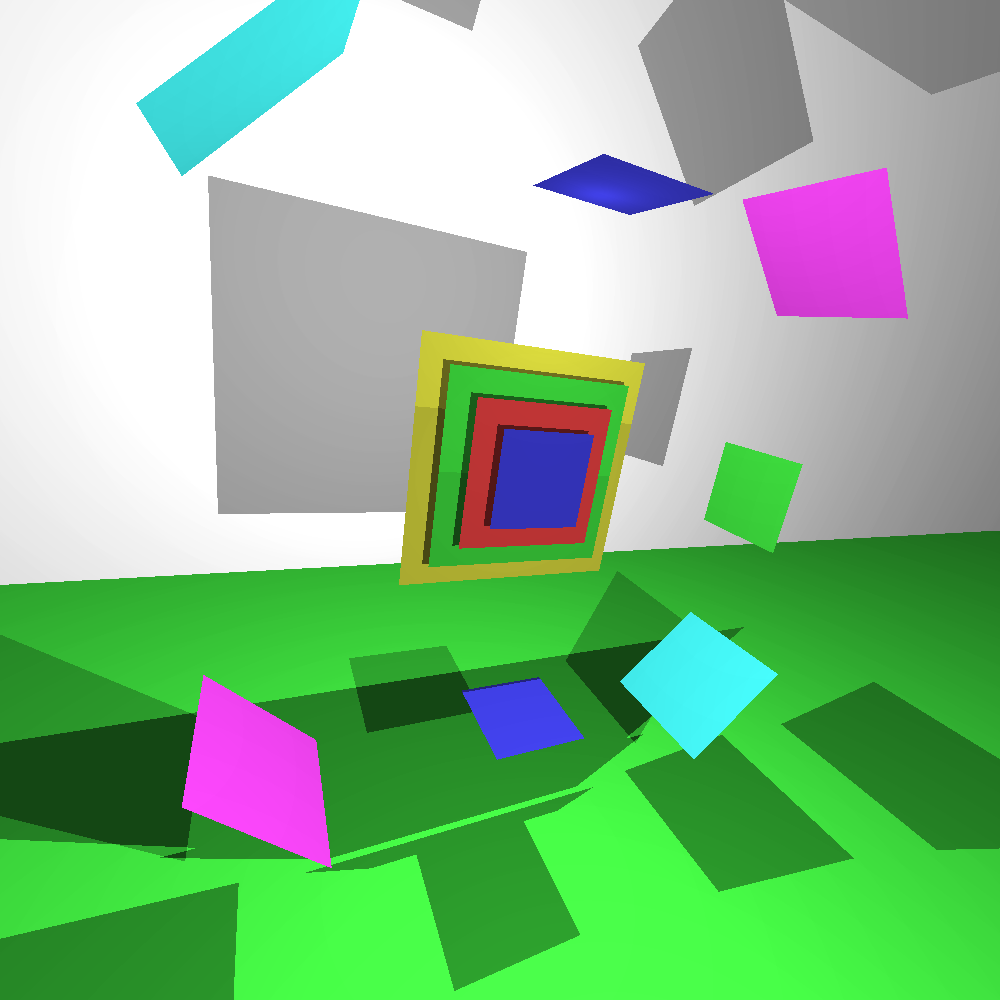
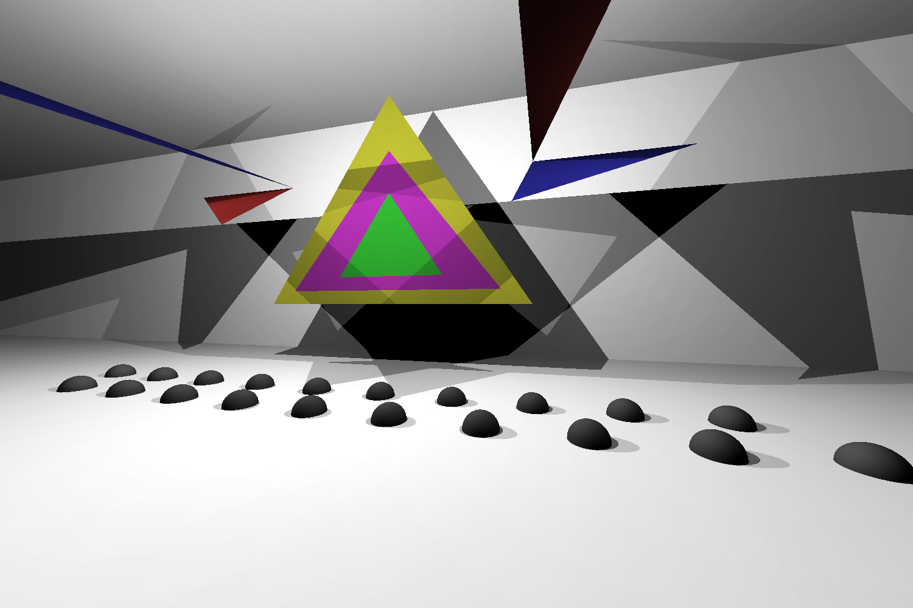

# miniRT project

  Mini ray-tracing project with 5 types of objects and camera position and directon control, lightnings and hard shadows.
  Without reflections, meshes or textures.
  
  Graphic library -- [minilibx](https://github.com/42Paris/minilibx-linux/tree/master) from ecole42.
  
  Languare: C

## Examples

###### 2generated.rt


###### jupyter.rt


###### rotates.rt


###### spheres.rt


###### square.rt


###### the_room.rt


###### triangle.rt


## Goal:
  Create own ray-tracing project with various types of objects (and hence the intersectionы, hello Linear Algebra) from .rt scene file.

## Result:

#### Supported figures:
  
- Sphere
- plane
- square
- triangle
- cylinder (without caps)

#### Lightnings options (including ambient):
  
- brightness
- (r,g,b) colors (for each figure too)

#### Camera options:
  
- Position
- Direction vector
- view angle

#### Window options:
  
- width and height

#### Other features:
  
- Camera switching (use arrows)
- Zoom  (arrows too)
- save to .bmp option (--save flag)

## Usage

#### Compiling:
| makefile rule  | Description                                           |
| -------------- | ----------------------------------------------------- |
|  all           | compiles minilibx, compiles project in miniRT binary  |

#### Execute:
```
./miniRT  <scene>.rt  [ --save <imagename.bmp> ]
```

#### \<scene\>.rt settings:

| command | Description                                             |
| ------------------------- | --------------------------------------------------------------------- |
| `# ........`               | Comments                                                              |
| `R w h`                   | Resolution settings. Set window width to `<w>` and height to `<h>`    |
| `A b r,g,b`               | Set ambient parameters. Brightness `b` and `r,g,b` color              |
|`c  x1,y1,z1  x2,y2,z2  a` | Creates camera at position `x1,y1,z2` with dir vector `x2,y2,z2` and view angle `a` |
|`l  x,y,z  b  r,g,b`       | Creates lightning at position `x,y,z` with brightness `b` and `r,g,b` color |
|           |                                                       |  
|`sp x,y,z  r  r,g,b`       | Creates sphere at position `x,y,z` with radius `b` and `r,g,b` color  |
|`pl x1,y1,z1  x2,y2,z2  r,g,b`| Creates plane at position `x1,y1,z2` with normal vector `x2,y2,z2` and `r,g,b` color |
|`sq x1,y1,z1  x2,y2,z2  s  r,g,b`| Creates square at position `x1,y1,z2` with normal vector `x2,y2,z2`, side `s` and `r,g,b` color |
|`tr x1,y1,z1  x2,y2,z2  x3,y3,z3  r,g,b`| Creates triangle with nodes at `x,y,z` positions with `r,g,b` color |
|`cy x1,y1,z1  x2,y2,z2  r  h  r,g,b`| Creates cylinder at position `x1,y1,z2` with normal vector `x2,y2,z2`, radius `r`, height `h` and `r,g,b` color |

Number of space or tabs (or any isspace(char)) doesn't matter.
